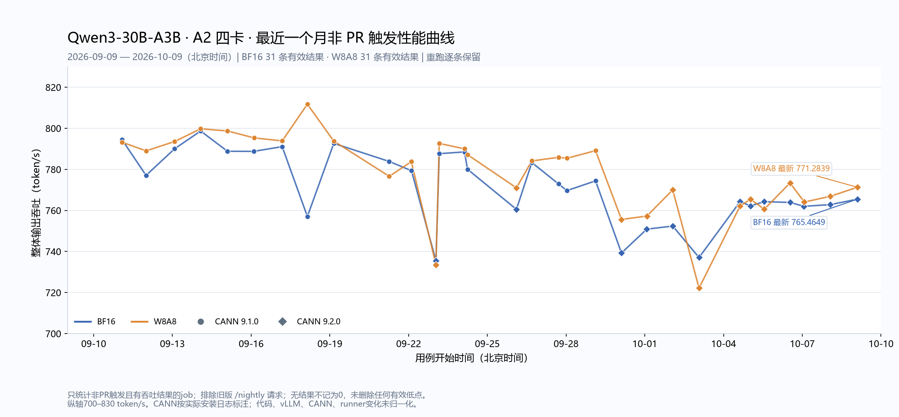

# 最近一个月非 PR 触发的 Qwen3 BF16 / W8A8 A2 性能曲线

统计区间：北京时间2026-09-09 00:00至2026-10-09 19:58:42。Nightly-A2 workflow，main分支运行。只统计非PR触发且有整体输出吞吐的job，保留各次重跑结果，不做每日平均，不剔除有效低点。

## 筛选规则

排除标题含`(PR)`、PR/issue-comment事件及job日志中非空/非零`request_id`的运行。早期标题只写`Nightly-A2`也可能由PR命令触发：本次追踪6个旧request_id，均指向`Handle /nightly Command`（pr_nightly_command.yml），相关9个job结果已排除。

保留非PR的定时/手动调度。GitHub API的event均为workflow_dispatch，不能据此认定是PR触发。无吞吐结果的job不计数量、均值或图中零值。job结论失败但有性能表时仍计入。

## 统计结果

| 模型 | 有效job结果 | workflow run | 均值 | 中位数 | 最低 | 最高 | 最新 | CANN 9.1.0 / 9.2.0 |
| --- | ---: | ---: | ---: | ---: | ---: | ---: | ---: | --- |
| BF16 | 31 | 30 | 771.5753 | 772.8905 | 735.4414 | 798.6856 | 765.4649 | 18 / 13 |
| W8A8 | 31 | 30 | 777.9714 | 784.1192 | 722.1660 | 811.7645 | 771.2839 | 18 / 13 |

单位为token/s。两个模型均有31条job结果、30个不同run，重跑重复测量逐条保留。

CANN按日志打印的ascend_toolkit_install.info版本标注；表中实际代码来自vLLM-Ascend Git信息/checkout，workflow commit另列。不同日期的代码、vLLM、CANN及runner变化未归一化，不能把曲线变化单独归因于CANN版本。

指标读取Common Metric中的`Output Token Throughput │ total`，多个性能表取最后一个；不取单请求OutputTokenThroughput均值或服务瞬时吞吐。

图例：蓝色BF16、橙色W8A8；圆点CANN9.1.0、菱形CANN9.2.0。纵轴700–830 token/s。

[交互图](throughput-comparison.html) · [BF16单独图](bf16-throughput-trend.png) · [W8A8单独图](w8a8-throughput-trend.png) · [合并CSV](measurements.csv) · [BF16 CSV](bf16.csv) · [W8A8 CSV](w8a8.csv)

## 有效结果明细

| 北京时间 | 模型 | 输出吞吐 | CANN | 状态 | 实际代码 | workflow commit | run / attempt | job |
| --- | --- | ---: | --- | --- | --- | --- | --- | --- |
| 2026-09-11 01:48:59 | W8A8 | 793.2474 | 9.1.0 | success | [7e0ad39fd](https://github.com/vllm-project/vllm-ascend/commit/7e0ad39fd1f4f9c55e5743fe45784fc6447399a1) | `c5055c808` | 34497670513 / 1 | [102981142060](https://github.com/vllm-project/vllm-ascend/actions/runs/34497670513/job/102981142060) |
| 2026-09-11 01:52:10 | BF16 | 794.4989 | 9.1.0 | success | [7e0ad39fd](https://github.com/vllm-project/vllm-ascend/commit/7e0ad39fd1f4f9c55e5743fe45784fc6447399a1) | `c5055c808` | 34497670513 / 1 | [102981142073](https://github.com/vllm-project/vllm-ascend/actions/runs/34497670513/job/102981142073) |
| 2026-09-11 23:53:52 | BF16 | 777.0744 | 9.1.0 | failure | [c843f75af](https://github.com/vllm-project/vllm-ascend/commit/c843f75aff45050fd4958dc4f24ac7e54a472df4) | `c843f75af` | 34617970118 / 1 | [103327196895](https://github.com/vllm-project/vllm-ascend/actions/runs/34617970118/job/103327196895) |
| 2026-09-11 23:54:59 | W8A8 | 789.0287 | 9.1.0 | success | [c843f75af](https://github.com/vllm-project/vllm-ascend/commit/c843f75aff45050fd4958dc4f24ac7e54a472df4) | `c843f75af` | 34617970118 / 1 | [103327196848](https://github.com/vllm-project/vllm-ascend/actions/runs/34617970118/job/103327196848) |
| 2026-09-13 01:59:38 | W8A8 | 793.5549 | 9.1.0 | success | [d4d2957e5](https://github.com/vllm-project/vllm-ascend/commit/d4d2957e5208c2f464d4625c05920bd29ea233cb) | `d4d2957e5` | 34703784818 / 1 | [103596224682](https://github.com/vllm-project/vllm-ascend/actions/runs/34703784818/job/103596224682) |
| 2026-09-13 02:00:53 | BF16 | 790.0201 | 9.1.0 | success | [d4d2957e5](https://github.com/vllm-project/vllm-ascend/commit/d4d2957e5208c2f464d4625c05920bd29ea233cb) | `d4d2957e5` | 34703784818 / 1 | [103596224725](https://github.com/vllm-project/vllm-ascend/actions/runs/34703784818/job/103596224725) |
| 2026-09-14 01:47:35 | W8A8 | 799.7720 | 9.1.0 | success | [660c4582a](https://github.com/vllm-project/vllm-ascend/commit/660c4582aa580ce98edc9b681bb6ff6d03153575) | `660c4582a` | 34766526376 / 1 | [103764867970](https://github.com/vllm-project/vllm-ascend/actions/runs/34766526376/job/103764867970) |
| 2026-09-14 01:48:19 | BF16 | 798.6856 | 9.1.0 | success | [660c4582a](https://github.com/vllm-project/vllm-ascend/commit/660c4582aa580ce98edc9b681bb6ff6d03153575) | `660c4582a` | 34766526376 / 1 | [103764868035](https://github.com/vllm-project/vllm-ascend/actions/runs/34766526376/job/103764868035) |
| 2026-09-15 02:20:31 | BF16 | 788.8191 | 9.1.0 | success | [b88c38c93](https://github.com/vllm-project/vllm-ascend/commit/b88c38c938b53265c997e003b32d764c0f797dc6) | `26f1363f7` | 34867800936 / 1 | [104097054774](https://github.com/vllm-project/vllm-ascend/actions/runs/34867800936/job/104097054774) |
| 2026-09-15 02:20:50 | W8A8 | 798.7114 | 9.1.0 | success | [b88c38c93](https://github.com/vllm-project/vllm-ascend/commit/b88c38c938b53265c997e003b32d764c0f797dc6) | `26f1363f7` | 34867800936 / 1 | [104097055078](https://github.com/vllm-project/vllm-ascend/actions/runs/34867800936/job/104097055078) |
| 2026-09-16 02:17:37 | BF16 | 788.7569 | 9.1.0 | success | [714dd1d1b](https://github.com/vllm-project/vllm-ascend/commit/714dd1d1ba032972e6a734254a816ca13c302da1) | `b49962987` | 34990518481 / 1 | [104472775960](https://github.com/vllm-project/vllm-ascend/actions/runs/34990518481/job/104472775960) |
| 2026-09-16 02:44:54 | W8A8 | 795.3345 | 9.1.0 | success | [714dd1d1b](https://github.com/vllm-project/vllm-ascend/commit/714dd1d1ba032972e6a734254a816ca13c302da1) | `b49962987` | 34990518481 / 1 | [104472775829](https://github.com/vllm-project/vllm-ascend/actions/runs/34990518481/job/104472775829) |
| 2026-09-17 04:22:47 | W8A8 | 793.8553 | 9.1.0 | success | [bdab8bde8](https://github.com/vllm-project/vllm-ascend/commit/bdab8bde86aad5eba3b362f923a3ff03b2c0e772) | `e1d149031` | 35140915567 / 1 | [104962193940](https://github.com/vllm-project/vllm-ascend/actions/runs/35140915567/job/104962193940) |
| 2026-09-17 04:22:56 | BF16 | 791.0792 | 9.1.0 | success | [bdab8bde8](https://github.com/vllm-project/vllm-ascend/commit/bdab8bde86aad5eba3b362f923a3ff03b2c0e772) | `e1d149031` | 35140915567 / 1 | [104962193793](https://github.com/vllm-project/vllm-ascend/actions/runs/35140915567/job/104962193793) |
| 2026-09-18 03:24:35 | W8A8 | 811.7645 | 9.1.0 | success | [c7ca0b676](https://github.com/vllm-project/vllm-ascend/commit/c7ca0b676b9668535f467b78cff1274a4ddb63b2) | `c7ca0b676` | 35253853308 / 1 | [105348688354](https://github.com/vllm-project/vllm-ascend/actions/runs/35253853308/job/105348688354) |
| 2026-09-18 03:25:51 | BF16 | 757.0391 | 9.1.0 | failure | [c7ca0b676](https://github.com/vllm-project/vllm-ascend/commit/c7ca0b676b9668535f467b78cff1274a4ddb63b2) | `c7ca0b676` | 35253853308 / 1 | [105348688564](https://github.com/vllm-project/vllm-ascend/actions/runs/35253853308/job/105348688564) |
| 2026-09-19 03:33:20 | W8A8 | 793.7787 | 9.1.0 | success | [c8addbb24](https://github.com/vllm-project/vllm-ascend/commit/c8addbb24fe8fa820bb79685c116e43ba89b77e9) | `c8addbb24` | 35376644941 / 1 | [105734114354](https://github.com/vllm-project/vllm-ascend/actions/runs/35376644941/job/105734114354) |
| 2026-09-19 03:33:51 | BF16 | 792.6629 | 9.1.0 | success | [c8addbb24](https://github.com/vllm-project/vllm-ascend/commit/c8addbb24fe8fa820bb79685c116e43ba89b77e9) | `c8addbb24` | 35376644941 / 1 | [105734114580](https://github.com/vllm-project/vllm-ascend/actions/runs/35376644941/job/105734114580) |
| 2026-09-21 06:16:40 | BF16 | 783.8601 | 9.1.0 | success | [c173a64a4](https://github.com/vllm-project/vllm-ascend/commit/c173a64a44dec4ba97aaba6277b1dfc1562eda19) | `c173a64a4` | 35535887772 / 1 | [106158819830](https://github.com/vllm-project/vllm-ascend/actions/runs/35535887772/job/106158819830) |
| 2026-09-21 06:17:50 | W8A8 | 776.6258 | 9.1.0 | failure | [c173a64a4](https://github.com/vllm-project/vllm-ascend/commit/c173a64a44dec4ba97aaba6277b1dfc1562eda19) | `c173a64a4` | 35535887772 / 1 | [106158819969](https://github.com/vllm-project/vllm-ascend/actions/runs/35535887772/job/106158819969) |
| 2026-09-22 02:30:34 | W8A8 | 783.7664 | 9.1.0 | success | [baa023ada](https://github.com/vllm-project/vllm-ascend/commit/baa023ada41a5b889cac6249845a688aab130892) | `baa023ada` | 35624826824 / 1 | [106451328520](https://github.com/vllm-project/vllm-ascend/actions/runs/35624826824/job/106451328520) |
| 2026-09-22 02:37:59 | BF16 | 779.3559 | 9.1.0 | success | [baa023ada](https://github.com/vllm-project/vllm-ascend/commit/baa023ada41a5b889cac6249845a688aab130892) | `baa023ada` | 35624826824 / 1 | [106451328450](https://github.com/vllm-project/vllm-ascend/actions/runs/35624826824/job/106451328450) |
| 2026-09-23 01:00:20 | BF16 | 735.4414 | 9.2.0 | failure | [baa023ada](https://github.com/vllm-project/vllm-ascend/commit/baa023ada41a5b889cac6249845a688aab130892) | `5591facb3` | 35745271509 / 2 | [106847569569](https://github.com/vllm-project/vllm-ascend/actions/runs/35745271509/job/106847569569) |
| 2026-09-23 01:00:40 | W8A8 | 733.4899 | 9.2.0 | failure | [baa023ada](https://github.com/vllm-project/vllm-ascend/commit/baa023ada41a5b889cac6249845a688aab130892) | `5591facb3` | 35745271509 / 2 | [106847569750](https://github.com/vllm-project/vllm-ascend/actions/runs/35745271509/job/106847569750) |
| 2026-09-23 04:00:09 | BF16 | 787.6478 | 9.1.0 | success | [a71b766ce](https://github.com/vllm-project/vllm-ascend/commit/a71b766ce6fc0a9669a412e15a5cf53f7f827093) | `a71b766ce` | 35765724272 / 1 | [106913453935](https://github.com/vllm-project/vllm-ascend/actions/runs/35765724272/job/106913453935) |
| 2026-09-23 04:00:19 | W8A8 | 792.6278 | 9.1.0 | success | [a71b766ce](https://github.com/vllm-project/vllm-ascend/commit/a71b766ce6fc0a9669a412e15a5cf53f7f827093) | `a71b766ce` | 35765724272 / 1 | [106913454027](https://github.com/vllm-project/vllm-ascend/actions/runs/35765724272/job/106913454027) |
| 2026-09-24 03:05:02 | W8A8 | 790.0360 | 9.1.0 | success | [ad7a731b9](https://github.com/vllm-project/vllm-ascend/commit/ad7a731b9c0db2592bbe1f568a776207745017ed) | `ad7a731b9` | 35894457906 / 1 | [107336621285](https://github.com/vllm-project/vllm-ascend/actions/runs/35894457906/job/107336621285) |
| 2026-09-24 03:06:19 | BF16 | 788.5001 | 9.1.0 | success | [ad7a731b9](https://github.com/vllm-project/vllm-ascend/commit/ad7a731b9c0db2592bbe1f568a776207745017ed) | `ad7a731b9` | 35894457906 / 1 | [107336621797](https://github.com/vllm-project/vllm-ascend/actions/runs/35894457906/job/107336621797) |
| 2026-09-24 05:50:26 | W8A8 | 787.1650 | 9.1.0 | success | [39fef3f8f](https://github.com/vllm-project/vllm-ascend/commit/39fef3f8fe71e71a8b7a684ae0f62b85ff18661f) | `39fef3f8f` | 35913876951 / 1 | [107397194238](https://github.com/vllm-project/vllm-ascend/actions/runs/35913876951/job/107397194238) |
| 2026-09-24 05:51:55 | BF16 | 780.0526 | 9.1.0 | success | [39fef3f8f](https://github.com/vllm-project/vllm-ascend/commit/39fef3f8fe71e71a8b7a684ae0f62b85ff18661f) | `39fef3f8f` | 35913876951 / 1 | [107397194489](https://github.com/vllm-project/vllm-ascend/actions/runs/35913876951/job/107397194489) |
| 2026-09-26 02:35:36 | BF16 | 760.5344 | 9.2.0 | failure | [baa023ada](https://github.com/vllm-project/vllm-ascend/commit/baa023ada41a5b889cac6249845a688aab130892) | `2bb3f4471` | 36156268364 / 1 | [108201226829](https://github.com/vllm-project/vllm-ascend/actions/runs/36156268364/job/108201226829) |
| 2026-09-26 02:37:15 | W8A8 | 770.9961 | 9.2.0 | failure | [baa023ada](https://github.com/vllm-project/vllm-ascend/commit/baa023ada41a5b889cac6249845a688aab130892) | `2bb3f4471` | 36156268364 / 1 | [108201226790](https://github.com/vllm-project/vllm-ascend/actions/runs/36156268364/job/108201226790) |
| 2026-09-26 16:40:07 | W8A8 | 784.1192 | 9.1.0 | success | [bbb5672af](https://github.com/vllm-project/vllm-ascend/commit/bbb5672af80b1972c301852aa505b13374fa6355) | `eb31db4d7` | 36225208422 / 1 | [108372470597](https://github.com/vllm-project/vllm-ascend/actions/runs/36225208422/job/108372470597) |
| 2026-09-26 16:41:50 | BF16 | 783.3198 | 9.1.0 | success | [bbb5672af](https://github.com/vllm-project/vllm-ascend/commit/bbb5672af80b1972c301852aa505b13374fa6355) | `eb31db4d7` | 36225208422 / 1 | [108372470704](https://github.com/vllm-project/vllm-ascend/actions/runs/36225208422/job/108372470704) |
| 2026-09-27 17:07:44 | BF16 | 772.8905 | 9.1.0 | failure | [7e2c563f5](https://github.com/vllm-project/vllm-ascend/commit/7e2c563f5e6ceddb5b0975753013832d356e096e) | `7e2c563f5` | 36302697268 / 1 | [108589310012](https://github.com/vllm-project/vllm-ascend/actions/runs/36302697268/job/108589310012) |
| 2026-09-27 17:09:43 | W8A8 | 785.8546 | 9.1.0 | success | [7e2c563f5](https://github.com/vllm-project/vllm-ascend/commit/7e2c563f5e6ceddb5b0975753013832d356e096e) | `7e2c563f5` | 36302697268 / 1 | [108589310238](https://github.com/vllm-project/vllm-ascend/actions/runs/36302697268/job/108589310238) |
| 2026-09-28 00:45:44 | BF16 | 769.6652 | 9.1.0 | failure | [8d4409d62](https://github.com/vllm-project/vllm-ascend/commit/8d4409d6256d8a6729140ddcc0d1889e3f96cdd6) | `8d4409d62` | 36327816101 / 1 | [108662359567](https://github.com/vllm-project/vllm-ascend/actions/runs/36327816101/job/108662359567) |
| 2026-09-28 00:47:39 | W8A8 | 785.4120 | 9.1.0 | success | [8d4409d62](https://github.com/vllm-project/vllm-ascend/commit/8d4409d6256d8a6729140ddcc0d1889e3f96cdd6) | `8d4409d62` | 36327816101 / 1 | [108662359368](https://github.com/vllm-project/vllm-ascend/actions/runs/36327816101/job/108662359368) |
| 2026-09-29 02:57:05 | BF16 | 774.3915 | 9.1.0 | failure | [b64b4d714](https://github.com/vllm-project/vllm-ascend/commit/b64b4d714484feaa6ca71edc99b98318fe6d2f0d) | `b64b4d714` | 36456246861 / 1 | [109085395373](https://github.com/vllm-project/vllm-ascend/actions/runs/36456246861/job/109085395373) |
| 2026-09-29 02:57:33 | W8A8 | 789.1202 | 9.1.0 | success | [b64b4d714](https://github.com/vllm-project/vllm-ascend/commit/b64b4d714484feaa6ca71edc99b98318fe6d2f0d) | `b64b4d714` | 36456246861 / 1 | [109085395854](https://github.com/vllm-project/vllm-ascend/actions/runs/36456246861/job/109085395854) |
| 2026-09-30 02:38:59 | BF16 | 739.2790 | 9.2.0 | failure | [b64b4d714](https://github.com/vllm-project/vllm-ascend/commit/b64b4d714484feaa6ca71edc99b98318fe6d2f0d) | `c39b31aab` | 36592566744 / 2 | [109548396956](https://github.com/vllm-project/vllm-ascend/actions/runs/36592566744/job/109548396956) |
| 2026-09-30 02:39:41 | W8A8 | 755.6040 | 9.2.0 | failure | [b64b4d714](https://github.com/vllm-project/vllm-ascend/commit/b64b4d714484feaa6ca71edc99b98318fe6d2f0d) | `c39b31aab` | 36592566744 / 2 | [109548396973](https://github.com/vllm-project/vllm-ascend/actions/runs/36592566744/job/109548396973) |
| 2026-10-01 01:49:05 | BF16 | 750.8766 | 9.2.0 | failure | [a40b52df0](https://github.com/vllm-project/vllm-ascend/commit/a40b52df0ef06a6360e2e97ce9b37a8939240d3f) | `62e05feb3` | 36740620800 / 1 | [110019706294](https://github.com/vllm-project/vllm-ascend/actions/runs/36740620800/job/110019706294) |
| 2026-10-01 01:54:41 | W8A8 | 757.2568 | 9.2.0 | failure | [a40b52df0](https://github.com/vllm-project/vllm-ascend/commit/a40b52df0ef06a6360e2e97ce9b37a8939240d3f) | `62e05feb3` | 36740620800 / 1 | [110019706766](https://github.com/vllm-project/vllm-ascend/actions/runs/36740620800/job/110019706766) |
| 2026-10-02 01:31:57 | W8A8 | 770.0295 | 9.2.0 | failure | [a8fcedb03](https://github.com/vllm-project/vllm-ascend/commit/a8fcedb03d93e60efceddbfc912406f7fa491d57) | `02615df12` | 36886694823 / 1 | [110496384097](https://github.com/vllm-project/vllm-ascend/actions/runs/36886694823/job/110496384097) |
| 2026-10-02 01:32:01 | BF16 | 752.3831 | 9.2.0 | failure | [a8fcedb03](https://github.com/vllm-project/vllm-ascend/commit/a8fcedb03d93e60efceddbfc912406f7fa491d57) | `02615df12` | 36886694823 / 1 | [110496384378](https://github.com/vllm-project/vllm-ascend/actions/runs/36886694823/job/110496384378) |
| 2026-10-03 01:35:07 | BF16 | 737.0680 | 9.2.0 | failure | [02615df12](https://github.com/vllm-project/vllm-ascend/commit/02615df12c0ad44bb7401cfc5c654fe16bebb7d0) | `4ebb3090f` | 37029162302 / 1 | [110952969576](https://github.com/vllm-project/vllm-ascend/actions/runs/37029162302/job/110952969576) |
| 2026-10-03 01:35:39 | W8A8 | 722.1660 | 9.2.0 | failure | [02615df12](https://github.com/vllm-project/vllm-ascend/commit/02615df12c0ad44bb7401cfc5c654fe16bebb7d0) | `4ebb3090f` | 37029162302 / 1 | [110952969797](https://github.com/vllm-project/vllm-ascend/actions/runs/37029162302/job/110952969797) |
| 2026-10-04 15:06:51 | BF16 | 764.2628 | 9.2.0 | failure | [4ebb3090f](https://github.com/vllm-project/vllm-ascend/commit/4ebb3090fc3c13c26557dcaae353882e70246649) | `f6992d8c4` | 37179121001 / 1 | [111383999096](https://github.com/vllm-project/vllm-ascend/actions/runs/37179121001/job/111383999096) |
| 2026-10-04 15:07:01 | W8A8 | 762.1402 | 9.2.0 | failure | [4ebb3090f](https://github.com/vllm-project/vllm-ascend/commit/4ebb3090fc3c13c26557dcaae353882e70246649) | `f6992d8c4` | 37179121001 / 1 | [111383999192](https://github.com/vllm-project/vllm-ascend/actions/runs/37179121001/job/111383999192) |
| 2026-10-05 00:37:50 | BF16 | 762.2176 | 9.2.0 | failure | [9b8fc5d72](https://github.com/vllm-project/vllm-ascend/commit/9b8fc5d728e1ea54dc277562b296112d905e15c1) | `7df960487` | 37214166426 / 1 | [111480582426](https://github.com/vllm-project/vllm-ascend/actions/runs/37214166426/job/111480582426) |
| 2026-10-05 00:38:22 | W8A8 | 765.4462 | 9.2.0 | failure | [9b8fc5d72](https://github.com/vllm-project/vllm-ascend/commit/9b8fc5d728e1ea54dc277562b296112d905e15c1) | `7df960487` | 37214166426 / 1 | [111480582321](https://github.com/vllm-project/vllm-ascend/actions/runs/37214166426/job/111480582321) |
| 2026-10-05 13:14:32 | W8A8 | 760.5895 | 9.2.0 | failure | [9b8fc5d72](https://github.com/vllm-project/vllm-ascend/commit/9b8fc5d728e1ea54dc277562b296112d905e15c1) | `7df960487` | 37214166426 / 2 | [111625406120](https://github.com/vllm-project/vllm-ascend/actions/runs/37214166426/job/111625406120) |
| 2026-10-05 13:16:02 | BF16 | 764.2751 | 9.2.0 | failure | [9b8fc5d72](https://github.com/vllm-project/vllm-ascend/commit/9b8fc5d728e1ea54dc277562b296112d905e15c1) | `7df960487` | 37214166426 / 2 | [111625406144](https://github.com/vllm-project/vllm-ascend/actions/runs/37214166426/job/111625406144) |
| 2026-10-06 12:48:30 | W8A8 | 773.3767 | 9.2.0 | failure | [7c67bcce3](https://github.com/vllm-project/vllm-ascend/commit/7c67bcce3bf750c5c762221e321976d26c551b49) | `4e19cc765` | 37335331287 / 3 | [112112680085](https://github.com/vllm-project/vllm-ascend/actions/runs/37335331287/job/112112680085) |
| 2026-10-06 12:48:58 | BF16 | 763.8790 | 9.2.0 | failure | [7c67bcce3](https://github.com/vllm-project/vllm-ascend/commit/7c67bcce3bf750c5c762221e321976d26c551b49) | `4e19cc765` | 37335331287 / 3 | [112112680131](https://github.com/vllm-project/vllm-ascend/actions/runs/37335331287/job/112112680131) |
| 2026-10-07 01:31:15 | BF16 | 762.0028 | 9.2.0 | failure | [acdd1baf9](https://github.com/vllm-project/vllm-ascend/commit/acdd1baf9140cb0277ab929ae30a1a181e32427d) | `437c06e1c` | 37490119275 / 1 | [112407946056](https://github.com/vllm-project/vllm-ascend/actions/runs/37490119275/job/112407946056) |
| 2026-10-07 01:53:38 | W8A8 | 764.0632 | 9.2.0 | failure | [acdd1baf9](https://github.com/vllm-project/vllm-ascend/commit/acdd1baf9140cb0277ab929ae30a1a181e32427d) | `437c06e1c` | 37490119275 / 1 | [112407946995](https://github.com/vllm-project/vllm-ascend/actions/runs/37490119275/job/112407946995) |
| 2026-10-08 01:42:48 | BF16 | 762.8288 | 9.2.0 | failure | [fe85f2bc4](https://github.com/vllm-project/vllm-ascend/commit/fe85f2bc4a652a0323b53c7cc4a22376f5c9d65e) | `0e181fc85` | 37646474685 / 2 | [112928617929](https://github.com/vllm-project/vllm-ascend/actions/runs/37646474685/job/112928617929) |
| 2026-10-08 01:42:56 | W8A8 | 766.8981 | 9.2.0 | failure | [fe85f2bc4](https://github.com/vllm-project/vllm-ascend/commit/fe85f2bc4a652a0323b53c7cc4a22376f5c9d65e) | `0e181fc85` | 37646474685 / 2 | [112928617938](https://github.com/vllm-project/vllm-ascend/actions/runs/37646474685/job/112928617938) |
| 2026-10-09 02:17:26 | BF16 | 765.4649 | 9.2.0 | failure | [a50eb57f1](https://github.com/vllm-project/vllm-ascend/commit/a50eb57f19974bcaeb10aedc074f24ba5dec98e6) | `6fd763c28` | 37803306965 / 1 | [113449976673](https://github.com/vllm-project/vllm-ascend/actions/runs/37803306965/job/113449976673) |
| 2026-10-09 02:25:22 | W8A8 | 771.2839 | 9.2.0 | failure | [a50eb57f1](https://github.com/vllm-project/vllm-ascend/commit/a50eb57f19974bcaeb10aedc074f24ba5dec98e6) | `6fd763c28` | 37803306965 / 1 | [113449976574](https://github.com/vllm-project/vllm-ascend/actions/runs/37803306965/job/113449976574) |

## 筛选证据

[filter-audit.json](filter-audit.json)记录PR排除规则和旧request_id；[旧请求来源](excluded-old-nightly-request-sources.json)保存对应workflow元数据。仅有吞吐结果进入measurements和statistics，未输出结果的job不计入性能统计。
