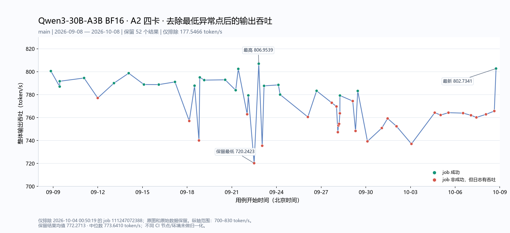

# 最近一个月 Qwen3-30B-A3B BF16 A2 输出吞吐

统计区间：北京时间2026-09-08 00:00至2026-10-08采集时。统计Nightly-A2 (scheduled) workflow运行于main分支的qwen3-30b-a3b-bf16-a2-performance；包含定时与手动触发，以及各次job重跑。

只统计有输出吞吐的53个job结果；无吞吐结果的job不计入统计数量、均值或图表。

均值 761.0501、中位数 772.8905、最低 177.5466、最高 806.9539 token/s。

指标按日志Common Metric中的`Output Token Throughput │ total`读取；有多个结果表时取最后一张。不是单请求`OutputTokenThroughput`均值，也不是vLLM服务日志的瞬时速率。job失败但有性能表时仍计入。

不同日期的代码、CANN、vLLM、runner及配置可能变化。此图是CI观测趋势，不是仅改变CANN版本的受控实验。

示例job核验：[107397194489](https://github.com/vllm-project/vllm-ascend/actions/runs/35913876951/job/107397194489) = **780.0526 token/s**。

交互图：[throughput-trend.html](throughput-trend.html)，可悬停查看commit，点击跳转job。CSV：[valid-throughput.csv](valid-throughput.csv)、[完整目标job记录](measurements.csv)。

## 去除最低异常点的版本

仅去掉 job 111247072388 的 177.5466 token/s，保留52条有吞吐的结果。纵轴为700–830 token/s。原图及原始数据保留。

## CANN版本与代码节点

每行CANN版本按job日志打印的`ascend_toolkit_install.info`中的`version`确认，不按workflow输入的`base_image_tag`推断。部分任务的输入tag与实际安装版本不一致；CSV及[cann-version-evidence.json](cann-version-evidence.json)保留安装内部版本、日志行号及输入tag。

表中的实际测试commit取日志里的vLLM-Ascend Git信息/checkout；workflow commit是控制workflow的节点。workflow运行于main可能仍是在测试PR代码，两列分开列出。所有表格和CSV只包含有吞吐结果的job。

有效结果：CANN 9.1.0 37条，CANN 9.2.0 16条。

## 有效结果明细

| 北京时间 | 吞吐 token/s | CANN | job状态 | 实际测试commit | workflow commit | run / attempt | job |
| --- | ---: | --- | --- | --- | --- | --- | --- |
| 2026-09-08 20:18:57 | 800.5221 | 9.1.0 | success | [17a2b63e3](https://github.com/vllm-project/vllm-ascend/commit/17a2b63e3b3f644f7b5b079fe0b88b5bf9565423) | `8ac532e62` | 34224770167 / 1 | [102057924729](https://github.com/vllm-project/vllm-ascend/actions/runs/34224770167/job/102057924729) |
| 2026-09-09 10:33:47 | 787.0243 | 9.1.0 | success | [7f2dfddf5](https://github.com/vllm-project/vllm-ascend/commit/7f2dfddf5ff91ef2a3c759f2c5d5f35e4d3b2316) | `f8481287a` | 34303330149 / 1 | [102315760542](https://github.com/vllm-project/vllm-ascend/actions/runs/34303330149/job/102315760542) |
| 2026-09-09 10:35:41 | 791.6659 | 9.1.0 | success | [7f2dfddf5](https://github.com/vllm-project/vllm-ascend/commit/7f2dfddf5ff91ef2a3c759f2c5d5f35e4d3b2316) | `f8481287a` | 34303456698 / 1 | [102316151689](https://github.com/vllm-project/vllm-ascend/actions/runs/34303456698/job/102316151689) |
| 2026-09-11 01:52:10 | 794.4989 | 9.1.0 | success | [7e0ad39fd](https://github.com/vllm-project/vllm-ascend/commit/7e0ad39fd1f4f9c55e5743fe45784fc6447399a1) | `c5055c808` | 34497670513 / 1 | [102981142073](https://github.com/vllm-project/vllm-ascend/actions/runs/34497670513/job/102981142073) |
| 2026-09-11 23:53:52 | 777.0744 | 9.1.0 | failure | [c843f75af](https://github.com/vllm-project/vllm-ascend/commit/c843f75aff45050fd4958dc4f24ac7e54a472df4) | `c843f75af` | 34617970118 / 1 | [103327196895](https://github.com/vllm-project/vllm-ascend/actions/runs/34617970118/job/103327196895) |
| 2026-09-13 02:00:53 | 790.0201 | 9.1.0 | success | [d4d2957e5](https://github.com/vllm-project/vllm-ascend/commit/d4d2957e5208c2f464d4625c05920bd29ea233cb) | `d4d2957e5` | 34703784818 / 1 | [103596224725](https://github.com/vllm-project/vllm-ascend/actions/runs/34703784818/job/103596224725) |
| 2026-09-14 01:48:19 | 798.6856 | 9.1.0 | success | [660c4582a](https://github.com/vllm-project/vllm-ascend/commit/660c4582aa580ce98edc9b681bb6ff6d03153575) | `660c4582a` | 34766526376 / 1 | [103764868035](https://github.com/vllm-project/vllm-ascend/actions/runs/34766526376/job/103764868035) |
| 2026-09-15 02:20:31 | 788.8191 | 9.1.0 | success | [b88c38c93](https://github.com/vllm-project/vllm-ascend/commit/b88c38c938b53265c997e003b32d764c0f797dc6) | `26f1363f7` | 34867800936 / 1 | [104097054774](https://github.com/vllm-project/vllm-ascend/actions/runs/34867800936/job/104097054774) |
| 2026-09-16 02:17:37 | 788.7569 | 9.1.0 | success | [714dd1d1b](https://github.com/vllm-project/vllm-ascend/commit/714dd1d1ba032972e6a734254a816ca13c302da1) | `b49962987` | 34990518481 / 1 | [104472775960](https://github.com/vllm-project/vllm-ascend/actions/runs/34990518481/job/104472775960) |
| 2026-09-17 04:22:56 | 791.0792 | 9.1.0 | success | [bdab8bde8](https://github.com/vllm-project/vllm-ascend/commit/bdab8bde86aad5eba3b362f923a3ff03b2c0e772) | `e1d149031` | 35140915567 / 1 | [104962193793](https://github.com/vllm-project/vllm-ascend/actions/runs/35140915567/job/104962193793) |
| 2026-09-18 03:25:51 | 757.0391 | 9.1.0 | failure | [c7ca0b676](https://github.com/vllm-project/vllm-ascend/commit/c7ca0b676b9668535f467b78cff1274a4ddb63b2) | `c7ca0b676` | 35253853308 / 1 | [105348688564](https://github.com/vllm-project/vllm-ascend/actions/runs/35253853308/job/105348688564) |
| 2026-09-18 11:57:28 | 787.7876 | 9.1.0 | success | [8f3976a7e](https://github.com/vllm-project/vllm-ascend/commit/8f3976a7e70b4d57617c0f45d96fd82053bd04c0) | `21bfcb10d` | 35304824742 / 1 | [105475587767](https://github.com/vllm-project/vllm-ascend/actions/runs/35304824742/job/105475587767) |
| 2026-09-18 19:04:00 | 740.0460 | 9.1.0 | failure | [82145c70d](https://github.com/vllm-project/vllm-ascend/commit/82145c70dffa369d82c3b0da97942266731f7e25) | `628fac6d8` | 35337261535 / 1 | [105576419718](https://github.com/vllm-project/vllm-ascend/actions/runs/35337261535/job/105576419718) |
| 2026-09-18 20:26:00 | 795.0060 | 9.1.0 | success | [e4c00b54e](https://github.com/vllm-project/vllm-ascend/commit/e4c00b54e6f90e98654f676bb5a0552dbf903632) | `8af9dff3a` | 35344050737 / 1 | [105598117731](https://github.com/vllm-project/vllm-ascend/actions/runs/35344050737/job/105598117731) |
| 2026-09-19 03:33:51 | 792.6629 | 9.1.0 | success | [c8addbb24](https://github.com/vllm-project/vllm-ascend/commit/c8addbb24fe8fa820bb79685c116e43ba89b77e9) | `c8addbb24` | 35376644941 / 1 | [105734114580](https://github.com/vllm-project/vllm-ascend/actions/runs/35376644941/job/105734114580) |
| 2026-09-20 13:18:58 | 792.9211 | 9.1.0 | success | [15d85da2c](https://github.com/vllm-project/vllm-ascend/commit/15d85da2c11bea06022ee3164baa3ead2f4c677f) | `182a7e496` | 35485902740 / 1 | [106026667217](https://github.com/vllm-project/vllm-ascend/actions/runs/35485902740/job/106026667217) |
| 2026-09-21 06:16:40 | 783.8601 | 9.1.0 | success | [c173a64a4](https://github.com/vllm-project/vllm-ascend/commit/c173a64a44dec4ba97aaba6277b1dfc1562eda19) | `c173a64a4` | 35535887772 / 1 | [106158819830](https://github.com/vllm-project/vllm-ascend/actions/runs/35535887772/job/106158819830) |
| 2026-09-21 10:26:50 | 802.4496 | 9.1.0 | success | [71a8bbfd5](https://github.com/vllm-project/vllm-ascend/commit/71a8bbfd52f2365f8dd53f339597fb9a82c5bb8c) | `72bde513b` | 35553865991 / 1 | [106194289882](https://github.com/vllm-project/vllm-ascend/actions/runs/35553865991/job/106194289882) |
| 2026-09-22 00:45:50 | 762.9025 | 9.1.0 | failure | [731afcbb2](https://github.com/vllm-project/vllm-ascend/commit/731afcbb2e9cd73914004337df6be7bfa4127c04) | `b1bb54388` | 35606823861 / 1 | [106406312839](https://github.com/vllm-project/vllm-ascend/actions/runs/35606823861/job/106406312839) |
| 2026-09-22 02:37:59 | 779.3559 | 9.1.0 | success | [baa023ada](https://github.com/vllm-project/vllm-ascend/commit/baa023ada41a5b889cac6249845a688aab130892) | `baa023ada` | 35624826824 / 1 | [106451328450](https://github.com/vllm-project/vllm-ascend/actions/runs/35624826824/job/106451328450) |
| 2026-09-22 11:59:51 | 720.2423 | 9.1.0 | failure | [0afb90113](https://github.com/vllm-project/vllm-ascend/commit/0afb901134c6a23d13cb6b6d7425c12e0d1f439a) | `baa023ada` | 35676345606 / 1 | [106606622015](https://github.com/vllm-project/vllm-ascend/actions/runs/35676345606/job/106606622015) |
| 2026-09-22 19:27:44 | 806.9539 | 9.1.0 | success | [41fc1a16c](https://github.com/vllm-project/vllm-ascend/commit/41fc1a16c4072772066790181dbb5099b34ed332) | `5c0470d90` | 35720949164 / 1 | [106725244296](https://github.com/vllm-project/vllm-ascend/actions/runs/35720949164/job/106725244296) |
| 2026-09-23 01:00:20 | 735.4414 | 9.2.0 | failure | [baa023ada](https://github.com/vllm-project/vllm-ascend/commit/baa023ada41a5b889cac6249845a688aab130892) | `5591facb3` | 35745271509 / 2 | [106847569569](https://github.com/vllm-project/vllm-ascend/actions/runs/35745271509/job/106847569569) |
| 2026-09-23 04:00:09 | 787.6478 | 9.1.0 | success | [a71b766ce](https://github.com/vllm-project/vllm-ascend/commit/a71b766ce6fc0a9669a412e15a5cf53f7f827093) | `a71b766ce` | 35765724272 / 1 | [106913453935](https://github.com/vllm-project/vllm-ascend/actions/runs/35765724272/job/106913453935) |
| 2026-09-24 03:06:19 | 788.5001 | 9.1.0 | success | [ad7a731b9](https://github.com/vllm-project/vllm-ascend/commit/ad7a731b9c0db2592bbe1f568a776207745017ed) | `ad7a731b9` | 35894457906 / 1 | [107336621797](https://github.com/vllm-project/vllm-ascend/actions/runs/35894457906/job/107336621797) |
| 2026-09-24 05:51:55 | 780.0526 | 9.1.0 | success | [39fef3f8f](https://github.com/vllm-project/vllm-ascend/commit/39fef3f8fe71e71a8b7a684ae0f62b85ff18661f) | `39fef3f8f` | 35913876951 / 1 | [107397194489](https://github.com/vllm-project/vllm-ascend/actions/runs/35913876951/job/107397194489) |
| 2026-09-26 02:35:36 | 760.5344 | 9.2.0 | failure | [baa023ada](https://github.com/vllm-project/vllm-ascend/commit/baa023ada41a5b889cac6249845a688aab130892) | `2bb3f4471` | 36156268364 / 1 | [108201226829](https://github.com/vllm-project/vllm-ascend/actions/runs/36156268364/job/108201226829) |
| 2026-09-26 16:41:50 | 783.3198 | 9.1.0 | success | [bbb5672af](https://github.com/vllm-project/vllm-ascend/commit/bbb5672af80b1972c301852aa505b13374fa6355) | `eb31db4d7` | 36225208422 / 1 | [108372470704](https://github.com/vllm-project/vllm-ascend/actions/runs/36225208422/job/108372470704) |
| 2026-09-27 17:07:44 | 772.8905 | 9.1.0 | failure | [7e2c563f5](https://github.com/vllm-project/vllm-ascend/commit/7e2c563f5e6ceddb5b0975753013832d356e096e) | `7e2c563f5` | 36302697268 / 1 | [108589310012](https://github.com/vllm-project/vllm-ascend/actions/runs/36302697268/job/108589310012) |
| 2026-09-28 00:45:44 | 769.6652 | 9.1.0 | failure | [8d4409d62](https://github.com/vllm-project/vllm-ascend/commit/8d4409d6256d8a6729140ddcc0d1889e3f96cdd6) | `8d4409d62` | 36327816101 / 1 | [108662359567](https://github.com/vllm-project/vllm-ascend/actions/runs/36327816101/job/108662359567) |
| 2026-09-28 02:56:59 | 747.2843 | 9.1.0 | failure | [02bebd5f4](https://github.com/vllm-project/vllm-ascend/commit/02bebd5f46326a3483e132443f5965f6a80d7579) | `8d4409d62` | 36340637637 / 1 | [108685222352](https://github.com/vllm-project/vllm-ascend/actions/runs/36340637637/job/108685222352) |
| 2026-09-28 03:54:47 | 753.1549 | 9.1.0 | failure | [02bebd5f4](https://github.com/vllm-project/vllm-ascend/commit/02bebd5f46326a3483e132443f5965f6a80d7579) | `8d4409d62` | 36345784830 / 1 | [108695295033](https://github.com/vllm-project/vllm-ascend/actions/runs/36345784830/job/108695295033) |
| 2026-09-28 05:00:54 | 754.5311 | 9.1.0 | failure | [02bebd5f4](https://github.com/vllm-project/vllm-ascend/commit/02bebd5f46326a3483e132443f5965f6a80d7579) | `8d4409d62` | 36349847575 / 1 | [108706991528](https://github.com/vllm-project/vllm-ascend/actions/runs/36349847575/job/108706991528) |
| 2026-09-28 06:13:24 | 763.6923 | 9.1.0 | failure | [02bebd5f4](https://github.com/vllm-project/vllm-ascend/commit/02bebd5f46326a3483e132443f5965f6a80d7579) | `8d4409d62` | 36354234703 / 1 | [108719413430](https://github.com/vllm-project/vllm-ascend/actions/runs/36354234703/job/108719413430) |
| 2026-09-28 06:19:34 | 779.2251 | 9.1.0 | success | [ed2220860](https://github.com/vllm-project/vllm-ascend/commit/ed22208600def08a0fba9903b3c715b325e01e4a) | `8d4409d62` | 36354586505 / 1 | [108720487234](https://github.com/vllm-project/vllm-ascend/actions/runs/36354586505/job/108720487234) |
| 2026-09-29 02:57:05 | 774.3915 | 9.1.0 | failure | [b64b4d714](https://github.com/vllm-project/vllm-ascend/commit/b64b4d714484feaa6ca71edc99b98318fe6d2f0d) | `b64b4d714` | 36456246861 / 1 | [109085395373](https://github.com/vllm-project/vllm-ascend/actions/runs/36456246861/job/109085395373) |
| 2026-09-29 07:27:51 | 748.3362 | 9.1.0 | failure | [c244f8e7f](https://github.com/vllm-project/vllm-ascend/commit/c244f8e7f6b46e64fc24d6ba6f6af79247218817) | `b64b4d714` | 36497700079 / 1 | [109182296591](https://github.com/vllm-project/vllm-ascend/actions/runs/36497700079/job/109182296591) |
| 2026-09-29 11:02:10 | 783.2062 | 9.1.0 | success | [9890fa615](https://github.com/vllm-project/vllm-ascend/commit/9890fa6152d28deb847187810ab85a4a1c96fedf) | `b185282b4` | 36514841209 / 1 | [109236147230](https://github.com/vllm-project/vllm-ascend/actions/runs/36514841209/job/109236147230) |
| 2026-09-30 02:38:59 | 739.2790 | 9.2.0 | failure | [b64b4d714](https://github.com/vllm-project/vllm-ascend/commit/b64b4d714484feaa6ca71edc99b98318fe6d2f0d) | `c39b31aab` | 36592566744 / 2 | [109548396956](https://github.com/vllm-project/vllm-ascend/actions/runs/36592566744/job/109548396956) |
| 2026-10-01 01:49:05 | 750.8766 | 9.2.0 | failure | [a40b52df0](https://github.com/vllm-project/vllm-ascend/commit/a40b52df0ef06a6360e2e97ce9b37a8939240d3f) | `62e05feb3` | 36740620800 / 1 | [110019706294](https://github.com/vllm-project/vllm-ascend/actions/runs/36740620800/job/110019706294) |
| 2026-10-01 11:10:07 | 759.2211 | 9.2.0 | failure | [d155d1155](https://github.com/vllm-project/vllm-ascend/commit/d155d1155260dc15d58404bfa36c0e766b9a4749) | `a8fcedb03` | 36808663716 / 1 | [110200286424](https://github.com/vllm-project/vllm-ascend/actions/runs/36808663716/job/110200286424) |
| 2026-10-02 01:32:01 | 752.3831 | 9.2.0 | failure | [a8fcedb03](https://github.com/vllm-project/vllm-ascend/commit/a8fcedb03d93e60efceddbfc912406f7fa491d57) | `02615df12` | 36886694823 / 1 | [110496384378](https://github.com/vllm-project/vllm-ascend/actions/runs/36886694823/job/110496384378) |
| 2026-10-03 01:35:07 | 737.0680 | 9.2.0 | failure | [02615df12](https://github.com/vllm-project/vllm-ascend/commit/02615df12c0ad44bb7401cfc5c654fe16bebb7d0) | `4ebb3090f` | 37029162302 / 1 | [110952969576](https://github.com/vllm-project/vllm-ascend/actions/runs/37029162302/job/110952969576) |
| 2026-10-04 00:50:19 | 177.5466 | 9.1.0 | failure | [fb813d848](https://github.com/vllm-project/vllm-ascend/commit/fb813d8482b4c8d1e2db5f820e28ebddcb55471d) | `4ebb3090f` | 37129575273 / 1 | [111247072388](https://github.com/vllm-project/vllm-ascend/actions/runs/37129575273/job/111247072388) |
| 2026-10-04 15:06:51 | 764.2628 | 9.2.0 | failure | [4ebb3090f](https://github.com/vllm-project/vllm-ascend/commit/4ebb3090fc3c13c26557dcaae353882e70246649) | `f6992d8c4` | 37179121001 / 1 | [111383999096](https://github.com/vllm-project/vllm-ascend/actions/runs/37179121001/job/111383999096) |
| 2026-10-05 00:37:50 | 762.2176 | 9.2.0 | failure | [9b8fc5d72](https://github.com/vllm-project/vllm-ascend/commit/9b8fc5d728e1ea54dc277562b296112d905e15c1) | `7df960487` | 37214166426 / 1 | [111480582426](https://github.com/vllm-project/vllm-ascend/actions/runs/37214166426/job/111480582426) |
| 2026-10-05 13:16:02 | 764.2751 | 9.2.0 | failure | [9b8fc5d72](https://github.com/vllm-project/vllm-ascend/commit/9b8fc5d728e1ea54dc277562b296112d905e15c1) | `7df960487` | 37214166426 / 2 | [111625406144](https://github.com/vllm-project/vllm-ascend/actions/runs/37214166426/job/111625406144) |
| 2026-10-06 12:48:58 | 763.8790 | 9.2.0 | failure | [7c67bcce3](https://github.com/vllm-project/vllm-ascend/commit/7c67bcce3bf750c5c762221e321976d26c551b49) | `4e19cc765` | 37335331287 / 3 | [112112680131](https://github.com/vllm-project/vllm-ascend/actions/runs/37335331287/job/112112680131) |
| 2026-10-07 01:31:15 | 762.0028 | 9.2.0 | failure | [acdd1baf9](https://github.com/vllm-project/vllm-ascend/commit/acdd1baf9140cb0277ab929ae30a1a181e32427d) | `437c06e1c` | 37490119275 / 1 | [112407946056](https://github.com/vllm-project/vllm-ascend/actions/runs/37490119275/job/112407946056) |
| 2026-10-07 10:16:15 | 760.1381 | 9.2.0 | failure | [971743a46](https://github.com/vllm-project/vllm-ascend/commit/971743a464aea1a0fc4109e8d2ff93a1349d577a) | `ec570818b` | 37560774961 / 1 | [112598434147](https://github.com/vllm-project/vllm-ascend/actions/runs/37560774961/job/112598434147) |
| 2026-10-08 01:42:48 | 762.8288 | 9.2.0 | failure | [fe85f2bc4](https://github.com/vllm-project/vllm-ascend/commit/fe85f2bc4a652a0323b53c7cc4a22376f5c9d65e) | `0e181fc85` | 37646474685 / 2 | [112928617929](https://github.com/vllm-project/vllm-ascend/actions/runs/37646474685/job/112928617929) |
| 2026-10-08 15:09:16 | 765.6941 | 9.2.0 | failure | [09185ed8a](https://github.com/vllm-project/vllm-ascend/commit/09185ed8a3e55d6d112c61cb7edcf005fdb43473) | `ac850b5ef` | 37717487442 / 1 | [113182291062](https://github.com/vllm-project/vllm-ascend/actions/runs/37717487442/job/113182291062) |
| 2026-10-08 17:56:48 | 802.7341 | 9.2.0 | success | [42d309a2b](https://github.com/vllm-project/vllm-ascend/commit/42d309a2b504c931dbd8dc6e3c0e191e3a59a390) | `cb9d5563a` | 37756272166 / 1 | [113252531808](https://github.com/vllm-project/vllm-ascend/actions/runs/37756272166/job/113252531808) |
