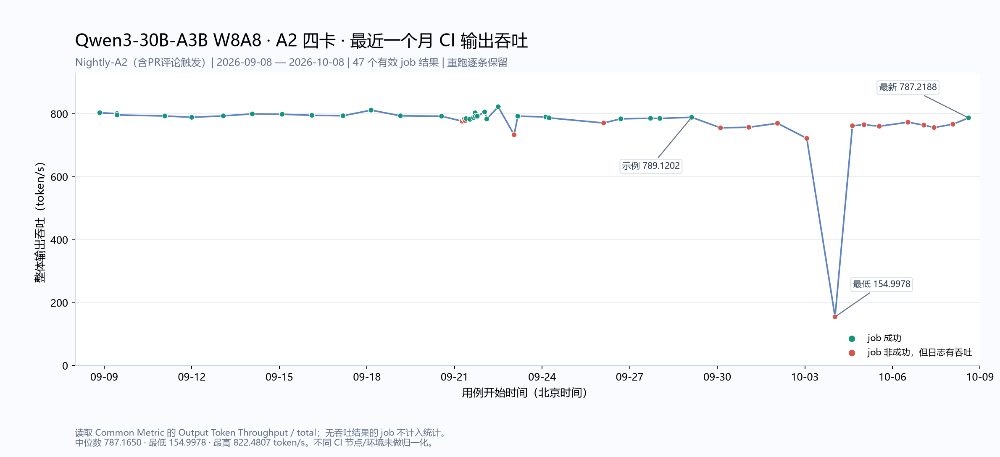
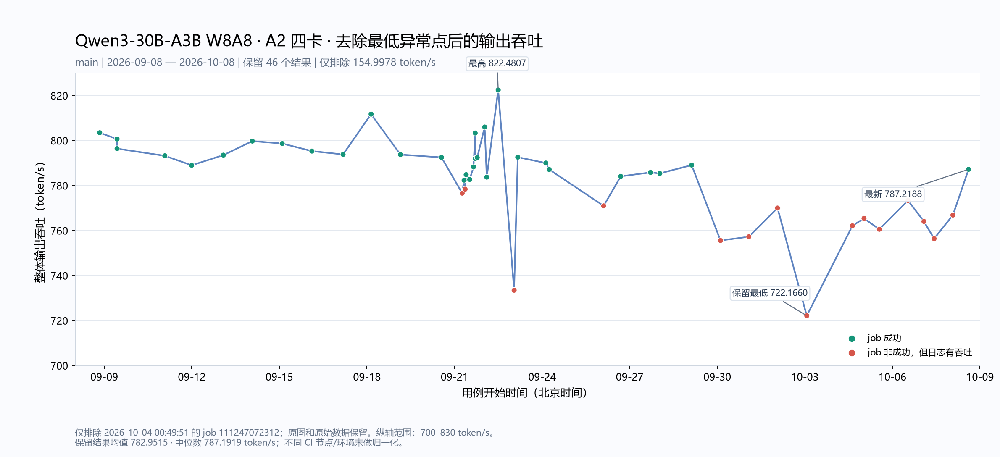

# 最近一个月 Qwen3-30B-A3B W8A8 A2 输出吞吐

统计区间：北京时间2026-09-08 00:00至2026-10-08采集时。统计Nightly-A2 (scheduled) workflow运行于main分支的qwen3-30b-a3b-w8a8-a2-performance；包含定时与手动触发，以及各次job重跑。

只统计日志中有吞吐的 47 条job结果，无吞吐结果的job不统计。

均值 769.5908、中位数 787.1650、最低 154.9978、最高 822.4807 token/s。

指标按日志Common Metric中的`Output Token Throughput │ total`读取；有多个结果表时取最后一张。不是单请求`OutputTokenThroughput`均值，也不是vLLM服务日志的瞬时速率。job失败但有性能表时仍计入。

包含main常规测试及PR评论触发的测试；workflow运行于main不代表测试代码来自main。CSV的tested_head_sha为日志核验的实际测试代码，head_sha为workflow控制节点。不同日期的代码、CANN、vLLM、runner及配置可能变化。此图是CI观测趋势，不是仅改变CANN版本的受控实验。

示例job核验：[109085395854](https://github.com/vllm-project/vllm-ascend/actions/runs/36456246861/job/109085395854) = **789.1202 token/s**。

交互图：[throughput-trend.html](throughput-trend.html)，可悬停查看commit，点击跳转job。CSV：[valid-throughput.csv](valid-throughput.csv)、[完整目标job记录](measurements.csv)。

## 去掉最低异常点的版本

仅排除 job 111247072312 的 154.9978 token/s，保留46条有效结果。均值782.9515、中位数787.1919 token/s；纵轴700–830 token/s。完整图和原始有效结果仍保留。

## CANN版本与代码节点

每行CANN版本按job日志打印的`ascend_toolkit_install.info`中的`version`确认，不按workflow输入的`base_image_tag`推断。部分任务的输入tag与实际安装版本不一致；CSV及[cann-version-evidence.json](cann-version-evidence.json)保留安装内部版本、日志行号及输入tag。

表中的实际测试commit取日志里的vLLM-Ascend Git信息/checkout；workflow commit是控制workflow的节点。workflow运行于main可能仍是在测试PR代码，两列分开列出。所有表格和CSV只包含有吞吐结果的job。

有效结果：CANN 9.1.0 33条，CANN 9.2.0 14条。

## 有效结果明细

| 北京时间 | 吞吐 token/s | CANN | job状态 | 实际测试commit | workflow commit | run / attempt | job |
| --- | ---: | --- | --- | --- | --- | --- | --- |
| 2026-09-08 20:18:58 | 803.4938 | 9.1.0 | success | [17a2b63e3](https://github.com/vllm-project/vllm-ascend/commit/17a2b63e3b3f644f7b5b079fe0b88b5bf9565423) | `8ac532e62` | 34224770167 / 1 | [102057924869](https://github.com/vllm-project/vllm-ascend/actions/runs/34224770167/job/102057924869) |
| 2026-09-09 10:33:48 | 800.7120 | 9.1.0 | success | [7f2dfddf5](https://github.com/vllm-project/vllm-ascend/commit/7f2dfddf5ff91ef2a3c759f2c5d5f35e4d3b2316) | `f8481287a` | 34303330149 / 1 | [102315760633](https://github.com/vllm-project/vllm-ascend/actions/runs/34303330149/job/102315760633) |
| 2026-09-09 10:35:34 | 796.4301 | 9.1.0 | success | [7f2dfddf5](https://github.com/vllm-project/vllm-ascend/commit/7f2dfddf5ff91ef2a3c759f2c5d5f35e4d3b2316) | `f8481287a` | 34303456698 / 1 | [102316151466](https://github.com/vllm-project/vllm-ascend/actions/runs/34303456698/job/102316151466) |
| 2026-09-11 01:48:59 | 793.2474 | 9.1.0 | success | [7e0ad39fd](https://github.com/vllm-project/vllm-ascend/commit/7e0ad39fd1f4f9c55e5743fe45784fc6447399a1) | `c5055c808` | 34497670513 / 1 | [102981142060](https://github.com/vllm-project/vllm-ascend/actions/runs/34497670513/job/102981142060) |
| 2026-09-11 23:54:59 | 789.0287 | 9.1.0 | success | [c843f75af](https://github.com/vllm-project/vllm-ascend/commit/c843f75aff45050fd4958dc4f24ac7e54a472df4) | `c843f75af` | 34617970118 / 1 | [103327196848](https://github.com/vllm-project/vllm-ascend/actions/runs/34617970118/job/103327196848) |
| 2026-09-13 01:59:38 | 793.5549 | 9.1.0 | success | [d4d2957e5](https://github.com/vllm-project/vllm-ascend/commit/d4d2957e5208c2f464d4625c05920bd29ea233cb) | `d4d2957e5` | 34703784818 / 1 | [103596224682](https://github.com/vllm-project/vllm-ascend/actions/runs/34703784818/job/103596224682) |
| 2026-09-14 01:47:35 | 799.7720 | 9.1.0 | success | [660c4582a](https://github.com/vllm-project/vllm-ascend/commit/660c4582aa580ce98edc9b681bb6ff6d03153575) | `660c4582a` | 34766526376 / 1 | [103764867970](https://github.com/vllm-project/vllm-ascend/actions/runs/34766526376/job/103764867970) |
| 2026-09-15 02:20:50 | 798.7114 | 9.1.0 | success | [b88c38c93](https://github.com/vllm-project/vllm-ascend/commit/b88c38c938b53265c997e003b32d764c0f797dc6) | `26f1363f7` | 34867800936 / 1 | [104097055078](https://github.com/vllm-project/vllm-ascend/actions/runs/34867800936/job/104097055078) |
| 2026-09-16 02:44:54 | 795.3345 | 9.1.0 | success | [714dd1d1b](https://github.com/vllm-project/vllm-ascend/commit/714dd1d1ba032972e6a734254a816ca13c302da1) | `b49962987` | 34990518481 / 1 | [104472775829](https://github.com/vllm-project/vllm-ascend/actions/runs/34990518481/job/104472775829) |
| 2026-09-17 04:22:47 | 793.8553 | 9.1.0 | success | [bdab8bde8](https://github.com/vllm-project/vllm-ascend/commit/bdab8bde86aad5eba3b362f923a3ff03b2c0e772) | `e1d149031` | 35140915567 / 1 | [104962193940](https://github.com/vllm-project/vllm-ascend/actions/runs/35140915567/job/104962193940) |
| 2026-09-18 03:24:35 | 811.7645 | 9.1.0 | success | [c7ca0b676](https://github.com/vllm-project/vllm-ascend/commit/c7ca0b676b9668535f467b78cff1274a4ddb63b2) | `c7ca0b676` | 35253853308 / 1 | [105348688354](https://github.com/vllm-project/vllm-ascend/actions/runs/35253853308/job/105348688354) |
| 2026-09-19 03:33:20 | 793.7787 | 9.1.0 | success | [c8addbb24](https://github.com/vllm-project/vllm-ascend/commit/c8addbb24fe8fa820bb79685c116e43ba89b77e9) | `c8addbb24` | 35376644941 / 1 | [105734114354](https://github.com/vllm-project/vllm-ascend/actions/runs/35376644941/job/105734114354) |
| 2026-09-20 13:19:20 | 792.5433 | 9.1.0 | success | [15d85da2c](https://github.com/vllm-project/vllm-ascend/commit/15d85da2c11bea06022ee3164baa3ead2f4c677f) | `182a7e496` | 35485902740 / 1 | [106026667233](https://github.com/vllm-project/vllm-ascend/actions/runs/35485902740/job/106026667233) |
| 2026-09-21 06:17:50 | 776.6258 | 9.1.0 | failure | [c173a64a4](https://github.com/vllm-project/vllm-ascend/commit/c173a64a44dec4ba97aaba6277b1dfc1562eda19) | `c173a64a4` | 35535887772 / 1 | [106158819969](https://github.com/vllm-project/vllm-ascend/actions/runs/35535887772/job/106158819969) |
| 2026-09-21 07:53:31 | 782.4173 | 9.1.0 | success | [5eccffd00](https://github.com/vllm-project/vllm-ascend/commit/5eccffd00c8ef58233a76a78c80b33039b06446c) | `c173a64a4` | 35545736131 / 1 | [106171730326](https://github.com/vllm-project/vllm-ascend/actions/runs/35545736131/job/106171730326) |
| 2026-09-21 08:44:39 | 778.4115 | 9.1.0 | failure | [5eccffd00](https://github.com/vllm-project/vllm-ascend/commit/5eccffd00c8ef58233a76a78c80b33039b06446c) | `c173a64a4` | 35548406902 / 1 | [106179106439](https://github.com/vllm-project/vllm-ascend/actions/runs/35548406902/job/106179106439) |
| 2026-09-21 09:32:47 | 784.8658 | 9.1.0 | success | [5eccffd00](https://github.com/vllm-project/vllm-ascend/commit/5eccffd00c8ef58233a76a78c80b33039b06446c) | `c173a64a4` | 35550977698 / 1 | [106186198193](https://github.com/vllm-project/vllm-ascend/actions/runs/35550977698/job/106186198193) |
| 2026-09-21 12:28:19 | 782.7378 | 9.1.0 | success | [b2c362207](https://github.com/vllm-project/vllm-ascend/commit/b2c362207cba51f77d78fe164143a380fdd51768) | `d05255207` | 35560768263 / 1 | [106213901721](https://github.com/vllm-project/vllm-ascend/actions/runs/35560768263/job/106213901721) |
| 2026-09-21 15:37:22 | 788.2960 | 9.1.0 | success | [b2c362207](https://github.com/vllm-project/vllm-ascend/commit/b2c362207cba51f77d78fe164143a380fdd51768) | `9693cc1a4` | 35573454894 / 1 | [106250988864](https://github.com/vllm-project/vllm-ascend/actions/runs/35573454894/job/106250988864) |
| 2026-09-21 16:59:28 | 803.3617 | 9.1.0 | success | [1e1dbd604](https://github.com/vllm-project/vllm-ascend/commit/1e1dbd60434396d8f6026e4f4cb9f3978901c9db) | `475a9a0b4` | 35580295526 / 1 | [106272761704](https://github.com/vllm-project/vllm-ascend/actions/runs/35580295526/job/106272761704) |
| 2026-09-21 17:04:07 | 792.0472 | 9.1.0 | success | [914bba50b](https://github.com/vllm-project/vllm-ascend/commit/914bba50b78e5b666ed8d93ace1093756fc376a8) | `d4511510e` | 35580733048 / 1 | [106274159404](https://github.com/vllm-project/vllm-ascend/actions/runs/35580733048/job/106274159404) |
| 2026-09-21 18:40:53 | 792.4597 | 9.1.0 | success | [00289eaf1](https://github.com/vllm-project/vllm-ascend/commit/00289eaf1578894c3d085cc0b4a5cfa4b318915e) | `eab5875da` | 35584252254 / 1 | [106301990974](https://github.com/vllm-project/vllm-ascend/actions/runs/35584252254/job/106301990974) |
| 2026-09-22 00:47:15 | 806.0405 | 9.1.0 | success | [731afcbb2](https://github.com/vllm-project/vllm-ascend/commit/731afcbb2e9cd73914004337df6be7bfa4127c04) | `b1bb54388` | 35606823861 / 1 | [106406312638](https://github.com/vllm-project/vllm-ascend/actions/runs/35606823861/job/106406312638) |
| 2026-09-22 02:30:34 | 783.7664 | 9.1.0 | success | [baa023ada](https://github.com/vllm-project/vllm-ascend/commit/baa023ada41a5b889cac6249845a688aab130892) | `baa023ada` | 35624826824 / 1 | [106451328520](https://github.com/vllm-project/vllm-ascend/actions/runs/35624826824/job/106451328520) |
| 2026-09-22 11:54:32 | 822.4807 | 9.1.0 | success | [0afb90113](https://github.com/vllm-project/vllm-ascend/commit/0afb901134c6a23d13cb6b6d7425c12e0d1f439a) | `baa023ada` | 35676345606 / 1 | [106606621833](https://github.com/vllm-project/vllm-ascend/actions/runs/35676345606/job/106606621833) |
| 2026-09-23 01:00:40 | 733.4899 | 9.2.0 | failure | [baa023ada](https://github.com/vllm-project/vllm-ascend/commit/baa023ada41a5b889cac6249845a688aab130892) | `5591facb3` | 35745271509 / 2 | [106847569750](https://github.com/vllm-project/vllm-ascend/actions/runs/35745271509/job/106847569750) |
| 2026-09-23 04:00:19 | 792.6278 | 9.1.0 | success | [a71b766ce](https://github.com/vllm-project/vllm-ascend/commit/a71b766ce6fc0a9669a412e15a5cf53f7f827093) | `a71b766ce` | 35765724272 / 1 | [106913454027](https://github.com/vllm-project/vllm-ascend/actions/runs/35765724272/job/106913454027) |
| 2026-09-24 03:05:02 | 790.0360 | 9.1.0 | success | [ad7a731b9](https://github.com/vllm-project/vllm-ascend/commit/ad7a731b9c0db2592bbe1f568a776207745017ed) | `ad7a731b9` | 35894457906 / 1 | [107336621285](https://github.com/vllm-project/vllm-ascend/actions/runs/35894457906/job/107336621285) |
| 2026-09-24 05:50:26 | 787.1650 | 9.1.0 | success | [39fef3f8f](https://github.com/vllm-project/vllm-ascend/commit/39fef3f8fe71e71a8b7a684ae0f62b85ff18661f) | `39fef3f8f` | 35913876951 / 1 | [107397194238](https://github.com/vllm-project/vllm-ascend/actions/runs/35913876951/job/107397194238) |
| 2026-09-26 02:37:15 | 770.9961 | 9.2.0 | failure | [baa023ada](https://github.com/vllm-project/vllm-ascend/commit/baa023ada41a5b889cac6249845a688aab130892) | `2bb3f4471` | 36156268364 / 1 | [108201226790](https://github.com/vllm-project/vllm-ascend/actions/runs/36156268364/job/108201226790) |
| 2026-09-26 16:40:07 | 784.1192 | 9.1.0 | success | [bbb5672af](https://github.com/vllm-project/vllm-ascend/commit/bbb5672af80b1972c301852aa505b13374fa6355) | `eb31db4d7` | 36225208422 / 1 | [108372470597](https://github.com/vllm-project/vllm-ascend/actions/runs/36225208422/job/108372470597) |
| 2026-09-27 17:09:43 | 785.8546 | 9.1.0 | success | [7e2c563f5](https://github.com/vllm-project/vllm-ascend/commit/7e2c563f5e6ceddb5b0975753013832d356e096e) | `7e2c563f5` | 36302697268 / 1 | [108589310238](https://github.com/vllm-project/vllm-ascend/actions/runs/36302697268/job/108589310238) |
| 2026-09-28 00:47:39 | 785.4120 | 9.1.0 | success | [8d4409d62](https://github.com/vllm-project/vllm-ascend/commit/8d4409d6256d8a6729140ddcc0d1889e3f96cdd6) | `8d4409d62` | 36327816101 / 1 | [108662359368](https://github.com/vllm-project/vllm-ascend/actions/runs/36327816101/job/108662359368) |
| 2026-09-29 02:57:33 | 789.1202 | 9.1.0 | success | [b64b4d714](https://github.com/vllm-project/vllm-ascend/commit/b64b4d714484feaa6ca71edc99b98318fe6d2f0d) | `b64b4d714` | 36456246861 / 1 | [109085395854](https://github.com/vllm-project/vllm-ascend/actions/runs/36456246861/job/109085395854) |
| 2026-09-30 02:39:41 | 755.6040 | 9.2.0 | failure | [b64b4d714](https://github.com/vllm-project/vllm-ascend/commit/b64b4d714484feaa6ca71edc99b98318fe6d2f0d) | `c39b31aab` | 36592566744 / 2 | [109548396973](https://github.com/vllm-project/vllm-ascend/actions/runs/36592566744/job/109548396973) |
| 2026-10-01 01:54:41 | 757.2568 | 9.2.0 | failure | [a40b52df0](https://github.com/vllm-project/vllm-ascend/commit/a40b52df0ef06a6360e2e97ce9b37a8939240d3f) | `62e05feb3` | 36740620800 / 1 | [110019706766](https://github.com/vllm-project/vllm-ascend/actions/runs/36740620800/job/110019706766) |
| 2026-10-02 01:31:57 | 770.0295 | 9.2.0 | failure | [a8fcedb03](https://github.com/vllm-project/vllm-ascend/commit/a8fcedb03d93e60efceddbfc912406f7fa491d57) | `02615df12` | 36886694823 / 1 | [110496384097](https://github.com/vllm-project/vllm-ascend/actions/runs/36886694823/job/110496384097) |
| 2026-10-03 01:35:39 | 722.1660 | 9.2.0 | failure | [02615df12](https://github.com/vllm-project/vllm-ascend/commit/02615df12c0ad44bb7401cfc5c654fe16bebb7d0) | `4ebb3090f` | 37029162302 / 1 | [110952969797](https://github.com/vllm-project/vllm-ascend/actions/runs/37029162302/job/110952969797) |
| 2026-10-04 00:49:51 | 154.9978 | 9.1.0 | failure | [fb813d848](https://github.com/vllm-project/vllm-ascend/commit/fb813d8482b4c8d1e2db5f820e28ebddcb55471d) | `4ebb3090f` | 37129575273 / 1 | [111247072312](https://github.com/vllm-project/vllm-ascend/actions/runs/37129575273/job/111247072312) |
| 2026-10-04 15:07:01 | 762.1402 | 9.2.0 | failure | [4ebb3090f](https://github.com/vllm-project/vllm-ascend/commit/4ebb3090fc3c13c26557dcaae353882e70246649) | `f6992d8c4` | 37179121001 / 1 | [111383999192](https://github.com/vllm-project/vllm-ascend/actions/runs/37179121001/job/111383999192) |
| 2026-10-05 00:38:22 | 765.4462 | 9.2.0 | failure | [9b8fc5d72](https://github.com/vllm-project/vllm-ascend/commit/9b8fc5d728e1ea54dc277562b296112d905e15c1) | `7df960487` | 37214166426 / 1 | [111480582321](https://github.com/vllm-project/vllm-ascend/actions/runs/37214166426/job/111480582321) |
| 2026-10-05 13:14:32 | 760.5895 | 9.2.0 | failure | [9b8fc5d72](https://github.com/vllm-project/vllm-ascend/commit/9b8fc5d728e1ea54dc277562b296112d905e15c1) | `7df960487` | 37214166426 / 2 | [111625406120](https://github.com/vllm-project/vllm-ascend/actions/runs/37214166426/job/111625406120) |
| 2026-10-06 12:48:30 | 773.3767 | 9.2.0 | failure | [7c67bcce3](https://github.com/vllm-project/vllm-ascend/commit/7c67bcce3bf750c5c762221e321976d26c551b49) | `4e19cc765` | 37335331287 / 3 | [112112680085](https://github.com/vllm-project/vllm-ascend/actions/runs/37335331287/job/112112680085) |
| 2026-10-07 01:53:38 | 764.0632 | 9.2.0 | failure | [acdd1baf9](https://github.com/vllm-project/vllm-ascend/commit/acdd1baf9140cb0277ab929ae30a1a181e32427d) | `437c06e1c` | 37490119275 / 1 | [112407946995](https://github.com/vllm-project/vllm-ascend/actions/runs/37490119275/job/112407946995) |
| 2026-10-07 10:16:12 | 756.4232 | 9.2.0 | failure | [971743a46](https://github.com/vllm-project/vllm-ascend/commit/971743a464aea1a0fc4109e8d2ff93a1349d577a) | `ec570818b` | 37560774961 / 1 | [112598434056](https://github.com/vllm-project/vllm-ascend/actions/runs/37560774961/job/112598434056) |
| 2026-10-08 01:42:56 | 766.8981 | 9.2.0 | failure | [fe85f2bc4](https://github.com/vllm-project/vllm-ascend/commit/fe85f2bc4a652a0323b53c7cc4a22376f5c9d65e) | `0e181fc85` | 37646474685 / 2 | [112928617938](https://github.com/vllm-project/vllm-ascend/actions/runs/37646474685/job/112928617938) |
| 2026-10-08 14:35:01 | 787.2188 | 9.2.0 | success | [09185ed8a](https://github.com/vllm-project/vllm-ascend/commit/09185ed8a3e55d6d112c61cb7edcf005fdb43473) | `ac850b5ef` | 37717487442 / 1 | [113182290813](https://github.com/vllm-project/vllm-ascend/actions/runs/37717487442/job/113182290813) |
